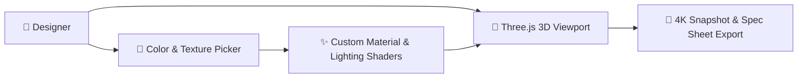

# 👟 KIXTRA /// STUDIO

> **Next-Gen 3D Sneaker Customizer & Luxury Streetwear E-Commerce Platform**  
> *Craft, Customize, and Experience 1-of-1 Footwear Designs in Real-Time.*

---

## 🌟 Visual Showcase & Interactive Screenshots

### 1. 🚀 Hero Studio Showcase & Live VIP Alarm

> **What this image represents:** The main landing experience of **KIXTRA /// STUDIO**. Features high-contrast neobrutalist typography, a 5-by-6 interactive rotating sneaker carousel, live countdown timer for upcoming VIP drops, and instant navigation triggers.

---

### 2. ⚡ Future Concept Drop Radar & Prototype X-Ray

> **What this image represents:** The **Prototype Drop Radar** where users can inspect unreleased footwear concepts, toggle wireframe X-Ray mode, analyze prototype engineering specifications (seamless upper mesh, zero-gravity midsoles), and instantly claim sizes or jump into 3D studio customization.

---

### 3. 📊 Trending Heat Catalog & Live Filter System

> **What this image represents:** The full in-stock catalog grid. Features real-time search filtering, dynamic category tags (`#New`, `#Hot`, `#Limited`, `#Platform`, `#Unisex`), custom price sorting, US size selection, quick-add actions, and 100% unique sneaker image cards.

---

### 4. 🎨 1-of-1 Customizer Master Studio

> **What this image represents:** The core **1-of-1 Customizer Laboratory**. Displays real-time SVG color swatch mapping for the base body, mesh upper, sole unit, and laces. Also includes dynamic heel embroidery font-size scaling and custom gift packaging options (Waterproof Duffle, Collector Briefcase).

---

### 5. 🛒 Brutalist Checkout System & Shopping Bag

> **What this image represents:** The seamless e-commerce engine. Shows the sliding cart drawer with real-time price calculations, quantity controls, working discount promo verification (e.g., `BRUTAL15`), and secure multi-payment checkout (Credit Card, Crypto, Klarna).

---

### 6. 🏆 Custom 1-of-1 Sneaker Renders
| 🌟 Solar Flare Neon Edition | ⚡ Cyber Chrome Glow Edition |
| :---: | :---: |
|  |  |
| *High-Vis Neon Orange & Cyber Blue Mesh* | *Reflective Metallic Casing & Active Green Accents* |

---

## 🧐 What is this Website?

**KIXTRA /// STUDIO** is a state-of-the-art web application built for sneakerheads, streetwear creators, and design enthusiasts. It combines a **high-contrast Neobrutalist visual aesthetic** with an **interactive 3D customizer laboratory**, allowing anyone to design, customize, and order 1-of-1 personalized sneakers online.

Built using **React 19, Vite, and Tailwind CSS**, the application runs smoothly on all devices with zero loading lag.

---

## 🎯 What is the Use of this Website?

* **Design Personalized Footwear**: Select base silhouettes, customize individual upper panels, sole unit pigments, lace colors, and heel embroidery font sizes.
* **Explore Live Streetwear Analytics**: Track real-time colorway popularity metrics and market heat index trends across global submissions.
* **Customize Packaging & Accessories**: Choose custom packaging bags (Waterproof Duffle, Collector Aluminum Briefcase) that dynamically calculate price add-ons.
* **Complete E-Commerce Experience**: Test adding items to bag, applying discount promos (e.g., `BRUTAL15`), selecting US shoe sizes, and placing mock orders via Credit Card, Crypto, or Klarna.

---

## 🎮 What is this Interactive Experience?

**KIXTRA /// STUDIO** is designed like an interactive **Sneaker Crafting Laboratory & Game**:

1. **🎨 3D Vector Customizer**: An interactive canvas mockup where every click instantly updates shoe colors, heel embroidery sizes, and packaging details in real-time.
2. **↔️ Prototype Comparison Slider**: A split-screen slider where you can drag a center divider to compare raw untreated white silhouettes against finished 1-of-1 custom beasts.
3. **📊 Editable Trend Matrix**: Creators can edit row names, change demand percentage metrics, update color swatches, or add custom trends directly in the UI.
4. **👑 Weekly Creator Competition**: Browse and vote for top community builds to see who wins weekly studio credits and free custom pairs!

---

## 🕹️ How Can a Person Use this Website?

1. **Explore the Collection**: Scroll through the homepage carousel, catalog filters, or spotlight drops.
2. **Launch 3D Studio**: Click **"Customize 1-of-1"** on any shoe card or trend preset to open the customizer.
3. **Craft Your Design**:
   * Pick swatches for **Base Body**, **Upper Trim**, **Sole Unit**, and **Laces**.
   * Adjust **Embroidery Font Size** (Small, Medium, Large) to fit your custom text.
   * Select your **Creator Packaging Bag**.
4. **Add to Bag & Checkout**: Pick your US shoe size (US 6 – 13), open the sliding shopping bag, apply discount codes, and complete the mock checkout!

---

## 🔥 Key Features & Capabilities

<details>
<summary><b>✨ Click to Expand Full Feature List</b></summary>

<br>

* 🎨 **Real-Time SVG Mockup Rendering**: Instant color mapping across all upper meshes, soles, and collar trims.
* ✍️ **Dynamic Heel Embroidery**: Live text rendering with dynamic font-size scaling on shoe heel tabs.
* 🎒 **Packaging Price Engine**: Automatic calculation of add-on costs for premium briefcases and duffle bags.
* 📊 **Live Trend Matrix Editor**: Full CRUD (Create, Read, Update, Delete) capability to customize trends right inside the analytics tab.
* 🏷️ **Dynamic Product Catalog**: 30+ luxury high-end sneakers pre-loaded with specs, movement profiles, and ratings.
* 🎟️ **Promo Code System**: Working discount verification (e.g., `BRUTAL15` for 15% off).
* 📱 **100% Responsive Design**: Pixel-perfect layout across mobile, tablet, and ultra-wide desktop displays.
</details>

---

## 🏛️ System Architecture



## 🛠️ Tech Stack & Architecture

* **Frontend Framework**: [React 19](https://react.dev/)
* **Build Tool & Bundler**: [Vite](https://vitejs.dev/)
* **Styling Engine**: [Tailwind CSS v4](https://tailwindcss.com/)
* **Icons & Visuals**: [Lucide React](https://lucide.dev/)
* **Special Effects**: [Canvas Confetti](https://www.npmjs.com/package/canvas-confetti/)
* **Language**: [TypeScript](https://www.typescriptlang.org/)

---

## 🚀 How to Install & Run Locally

### Prerequisites
Make sure you have **Node.js** (v18 or higher) installed on your system.

### Installation Steps

1. **Clone the Repository:**
   ```bash
   git clone https://github.com/SriniwasAwasthi/KIXTRA-STUDIO.git
   cd KIXTRA-STUDIO
   ```

2. **Install Dependencies:**
   ```bash
   npm install
   ```

3. **Start Development Server:**
   ```bash
   npm run dev
   ```

4. **Build for Production:**
   ```bash
   npm run build
   ```

---

## 💖 Thank You for Visiting & Exploring 👟 KIXTRA /// STUDIO!

> *"Thank you for taking the time to explore this project! Continuous learning, clean craftsmanship, and solving real-world challenges through elegant software are at the core of my developer journey."* 🚀

* 🌟 **Enjoyed this project?** If you found this repository interesting or helpful, please consider giving it a **Star**!\
* 📬 **Let's Connect & Collaborate:** I am actively seeking engineering opportunities, impactful internships, and open-source collaborations. Feel free to connect via [GitHub](https://github.com/SriniwasAwasthi) or [Email](mailto:sriawasthi164@gmail.com)
  * 🌐 **LinkedIn:** [https://www.linkedin.com/in/sriniwas-awasthi/](https://www.linkedin.com/in/sriniwas-awasthi/).

---
<div align="center">
  <sub>Designed & Crafted with Passion by <a href="https://github.com/SriniwasAwasthi"><strong>Sriniwas Awasthi</strong></a> • Continuous Learner & Software Engineer</sub>
</div>
